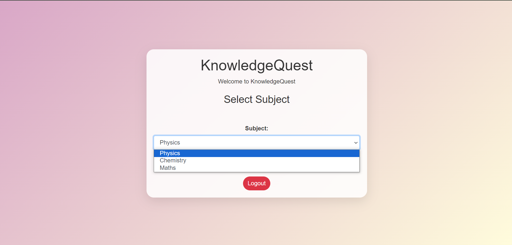

# Knowledge Quest

Knowledge Quest is an interactive quiz website where users can take quizzes on Physics, Chemistry, and Math. It is built using Spring Boot, HTML, Bootstrap, and JavaScript.

## Features

- Quizzes on Physics, Chemistry, and Math
- User-friendly interface
- Responsive design using Bootstrap
- Real-time quiz scoring
- Admin panel to add questions to any category

## Tech Stack

- **Backend:** Spring Boot
- **Frontend:** HTML, CSS, Bootstrap, JavaScript
- **Database:** MySQL
- **Build Tool:** Maven

## Demo



## Installation

1. Clone the repository:

    ```bash
    git clone https://github.com/RounakSain17/KnowledgeQuest
    ```

2. Open the project directory:

    ```bash
    cd knowledge-quest
    ```

3. Configure the MySQL database:

    - Create a database in MySQL:

        ```sql
        CREATE DATABASE quizdb;
        ```

    - Update the `application.properties` file with your MySQL credentials and other settings:

        ```properties
        spring.application.name=Quiz-Website
        server.port=8090
        spring.datasource.url=jdbc:mysql://localhost:3306/quizdb
        spring.datasource.username="Your Username"
        spring.datasource.password="Your password"
        spring.datasource.driver-class-name=com.mysql.cj.jdbc.Driver

        # JPA / Hibernate settings
        spring.jpa.hibernate.ddl-auto=update
        spring.jpa.show-sql=true
        spring.jpa.properties.hibernate.dialect=org.hibernate.dialect.MySQLDialect

        # Thymeleaf settings
        spring.thymeleaf.cache=false

        spring.thymeleaf.prefix=classpath:/templates/
        spring.thymeleaf.suffix=.html
        spring.mvc.view.prefix=/WEB-INF/views/
        spring.mvc.view.suffix=.jsp
        ```

4. Build the project using Maven:

    ```bash
    mvn clean install
    ```

5. Run the Spring Boot application:

    ```bash
    mvn spring-boot:run
    ```

6. Open your web browser and navigate to `http://localhost:8090`.

## Usage

1. **User:**
   - Select a quiz category: Physics, Chemistry, or Math.
   - Answer the questions presented in the quiz.
   - Submit the quiz to see your score and correct answers.

2. **Admin:**
   - Access the admin panel by navigating to `http://localhost:8090/admin/login`.
   - Add questions to any category (Physics, Chemistry, Math).

## Configuration

1. To modify quiz questions, edit the respective JSON files located in the `src/main/resources` directory.
2. Customize the website's appearance by editing the HTML and CSS files in the `src/main/resources/templates` and `src/main/resources/static/css` directories, respectively.

## Contributing

1. Fork the repository.
2. Create a new branch:

    ```bash
    git checkout -b feature/your-feature-name
    ```

3. Make your changes and commit them:

    ```bash
    git commit -m 'Add some feature'
    ```

4. Push to the branch:

    ```bash
    git push origin feature/your-feature-name
    ```

5. Open a pull request.

## License

This project is licensed under the MIT License - see the [LICENSE](LICENSE) file for details.

## Acknowledgements

- [Spring Boot](https://spring.io/projects/spring-boot)
- [Bootstrap](https://getbootstrap.com/)
- [Font Awesome](https://fontawesome.com/) for icons
